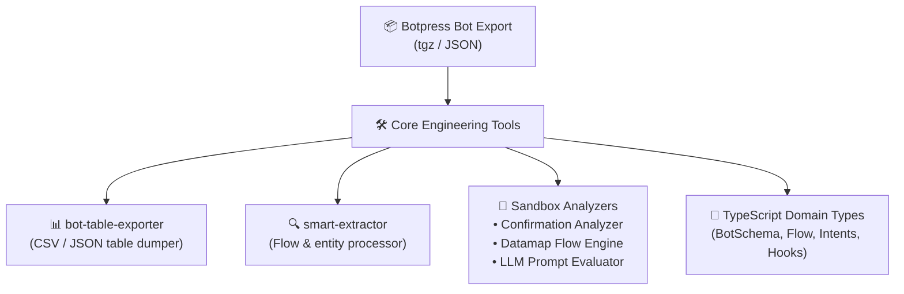

# 🤖 Botpress Backup Template & Conversational Agent Toolkit

[](https://github.com/jgu7man/botpress-backup-template)
[](https://botpress.com)
[](LICENSE)

A comprehensive development toolkit and type system for **Botpress v12**, designed for technical inspection, automated table extraction, flow analysis, intent validation, and confirmation prompt evaluation.

---

## 💡 Overview & Architecture

When engineering advanced conversational bots in Botpress, project exports contain compressed JSON topologies, custom JavaScript hooks, knowledge bases, and complex decision state machines.

This repository provides full **TypeScript type definitions**, standalone extraction tools, and analysis sandboxes:



---

## 📦 Project Structure & Modules

```plaintext
botpress-backup-template/
│
├── tools/
│   ├── bot-table-exporter/        # Tool to extract, format, and dump Botpress tables
│   │   ├── core/                  # Table parsing logic & database drivers
│   │   ├── exporters/             # CSV & JSON formatting exporters
│   │   ├── utils/                 # File & string normalization helpers
│   │   ├── index.ts               # Exporter library entry point
│   │   └── run.ts                 # CLI runner script
│   └── smart-extractor/           # Smart extraction of intents, slots & flow variables
│       └── main.ts
│
├── types/                         # Complete Botpress TypeScript type declarations
│   ├── bot/                       # Bot topology types
│   │   ├── BotExport.ts           # Root export schema
│   │   ├── BotSchema.ts           # Bot manifest definition
│   │   ├── Flow.ts & Flow2.ts     # Visual flow state machines & transitions
│   │   ├── Intents.ts             # NLU intents, slots & utterances
│   │   ├── Hooks.ts               # Botpress server hooks & action scripts
│   │   ├── Knowledge_base.ts      # FAQ & Knowledge base document schemas
│   │   ├── Table.ts               # Built-in Botpress database table schemas
│   │   ├── Workflow.ts            # Enterprise workflow transitions
│   │   └── Settings.ts            # Bot runtime settings
│   └── core/                      # Core runtime event types
│       ├── Turn.ts                # Dialog turn context & session state
│       ├── event.type.ts          # Incoming/Outgoing messaging events
│       └── TableOperations.d.ts   # Database CRUD contracts
│
├── sandbox/                       # Experimental evaluation & prototyping suites
│   ├── confirmation-analysis-system/ # NLP & rule-based confirmation detector
│   │   ├── confirmation-analyzer.ts
│   │   ├── confirmation-patterns.ts
│   │   └── confirmation-demo.ts
│   ├── datamap-flow/              # Dynamic multi-step form collection engine
│   │   ├── initiate-form-status.ts
│   │   ├── get-next-field.ts
│   │   └── mark-failed-field.ts
│   └── prompts/                   # LLM prompt templates & evaluation benchmarks
│       ├── analyze-answer-type.prompt.md
│       ├── analyze-confirmation-optimized.prompt.md
│       └── evaluacion-prompt-confirmaciones.md
│
├── package.json                   # Root package dependencies
├── tsconfig.json                  # Strict TypeScript configuration
└── README.md                      # Documentation
```

---

## 🚀 Key Modules & Capabilities

### 1. 📊 Bot Table Exporter (`tools/bot-table-exporter`)
Extracts custom user tables, session variables, and conversation logs from exported bot state into clean tabular formats:
```bash
cd tools/bot-table-exporter
npm install
npm run start
```

### 2. 🧪 Confirmation Analysis System (`sandbox/confirmation-analysis-system`)
An intelligent NLP analyzer that detects user intent during affirmative/negative confirmation turns (e.g. distinguishing *"sí, claro"*, *"por ahora no"*, *"correcto"*):
```bash
# Run confirmation analysis demo
npx ts-node sandbox/confirmation-analysis-system/confirmation-demo.ts
```

### 3. 📝 Dynamic Datamap Flow (`sandbox/datamap-flow`)
A state-machine engine for Botpress that orchestrates multi-step form collection, retries failed field inputs, and tracks session validation status.

---

## 📄 License

Distributed under the [MIT License](LICENSE). Created by [Jorge Guzmán (@jgu7man)](https://github.com/jgu7man).
